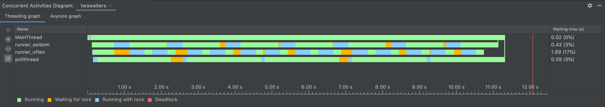

# Two Waiters
A small example of two threads executing actions in python

# What can I learn from this repository

* Subclasssing (a subclassed thread that starts on initialisation)
* Minimally using locks, queues and threads
* Clear variable names
* Which function called another function?
* Longpolling
* Light typing of function arguments
* Comments only where necessary (here in if __name__ == "__main__")
* Dataclass objects

# How does it work?

* An action queue with "tasks" is created
* Two running threads running either "seldom" or "often" are associated
* Each thread has a target that determines how to perform the task
* A third "longpoll" thread polls for whether there are threads remaining

# Extras
 
A nice concurrency diagram from pycharm (yay!)

